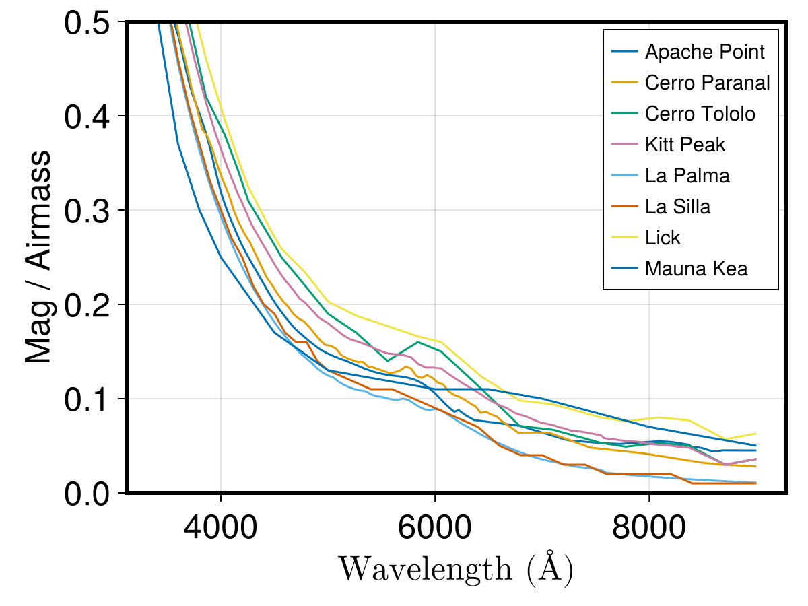

# AtmosphericExtinction.jl

[](https://github.com/stefanocovino/AtmosphericExtinction.jl/actions/workflows/CI.yml?query=branch%3Amain)
[](https://stefanocovino.github.io/AtmosphericExtinction.jl/stable/)


This is a very simple package providing a convenience function to access to atmoshperic extinction tables in the optical bands.

## Installation


```julia
using Pkg
Pkg.add(url="https://github.com/stefanocovino/AtmoshpericExtinction.jl.git")
```

or

```julia
using Pkg
Pkg.add("AtmoshpericExtinction")
```

will install this package, with the latter when the package (if ever) will be registered.


[Here](https://stefanocovino.github.io/AtmosphericExtinction.jl/stable/)'s the documentation!


## Possible use

```julia
using AtmosphericExtinction
using Unitful
```


A list of the known site can be obtained by:

```julia
GetKnownRecipes()
```
```
Apache Point
Cerro Paranal
Cerro Tololo
Kitt Peak
La Palma
La Silla
Lick
Mauna Kea
```

We plan to add as many site information as possible in the future.

The extinction (magnitude/airmass) for any given available observing site, e.g. La Silla, can be obtained by:

```julia
using Unitful

Recipes["La Silla"].table(3500*u"angstrom":1*u"angstrom":4000*u"angstrom")
```
```
501-element Vector{Float64}:
 0.52
 0.5194000000000001
 0.5188
 0.5182
 0.5176
 0.517
 0.5164
 0.5158
 0.5152000000000001
 0.5146000000000001
 0.514
 ⋮
 0.3027
 0.3024
 0.30210000000000004
 0.3018
 0.3015
 0.30119999999999997
 0.3009
 0.3006
 0.3003
 0.3
 ```

While the limits in wavelength for a given atmospheric extinction can be read by:

```julia

Extrapolations from the intput table wavelength limits throws an error.
Recipes["La Silla"].lims
```
```
2-element Vector{Quantity{Float64, 𝐋, Unitful.FreeUnits{(Å,), 𝐋, nothing}}}:
 3100.0 Å
 9000.0 Å
 ```

Extrapolation beyond these limits is allowed following a `flat` strategy, i.e., the last value on the lowest and highest wavelnegth value is adopted. This might or might not be acceptable, depending on the specific problem you are addressing.


As mentioned above, `Cerro Paranal` data provide ucertainties too, e.g.:

```julia
using Unitful

Recipes["Cerro Paranal"].table(3500*u"angstrom":1*u"angstrom":4000*u"angstrom")
```
```
501-element Vector{Measurement{Float64}}:
  0.539 ± 0.0046
 0.5385 ± 0.0046
  0.538 ± 0.0046
 0.5374 ± 0.0046
 0.5369 ± 0.0046
 0.5364 ± 0.0046
 0.5359 ± 0.0046
 0.5354 ± 0.0046
 0.5348 ± 0.0046
 0.5343 ± 0.0047
 0.5338 ± 0.0047
        ⋮
 0.3402 ± 0.003
 0.3399 ± 0.003
 0.3396 ± 0.0029
 0.3393 ± 0.0029
  0.339 ± 0.0029
 0.3387 ± 0.0029
 0.3384 ± 0.0028
 0.3381 ± 0.0028
 0.3378 ± 0.0028
 0.3375 ± 0.0028
 ```

Data for the extinction only are easily derivable by:

```julia
using Measurements

Measurements.value.(Recipes["Cerro Paranal"].table(3500*u"angstrom":1*u"angstrom":4000*u"angstrom"))
```


This is a plot showing the recipes at present available:




### References

These are the references for the availbale atmoshperic extinction tables, partly derived from data included in the [specreduce](https://specreduce.readthedocs.io/en/latest/index.html) `python` package.

- The extinction table for the *Apache Point Observatory* is based on the extinction table used for the [SDSS](https://www.apo.nmsu.edu/arc35m/Instruments/DIS/).
- The extinction table for the Cerro Paranal is taken from [Patat et al. (2011)](https://ui.adsabs.harvard.edu/abs/2011A%26A...527A..91P/abstract). This is the only case where the uncertainties on the extinction are reported.
- The extinction table for the Cerro Tololo is taken from the calibration data included in [IRAF](https://en.wikipedia.org/wiki/IRAF).
- The extinction table for the Kitt Peak is taken from the calibration data included in [IRAF](https://en.wikipedia.org/wiki/IRAF).
- The extinction table for La Palma is taken from the technical note [King (1985)](https://www.ing.iac.es/Astronomy/observing/manuals/ps/tech_notes/tn031.pdf).
- The extinction table for La Silla is taken from the [ESO website](https://www.eso.org/sci/observing/tools/Extinction.html).
- The extinction table for the Lick Observatory is taken from [these tables](https://mthamilton.ucolick.org/techdocs/standards/lick_mean_extinct.html).
- The extinction curve for the Manua Kea is taken from [Buton et al. (2013](https://mthamilton.ucolick.org/techdocs/standards/lick_mean_extinct.html).


We are glad to include more extinction tables, if available.

